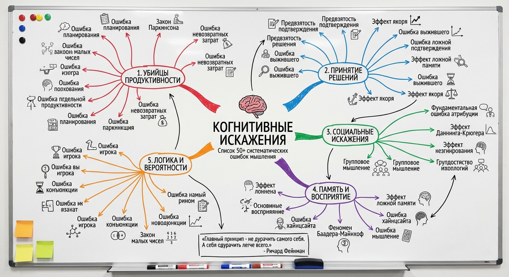

# 🧠 Когнитивные искажения
 
Этот репозиторий является дополнением к моим статьям, который будет постоянно дополняться. На данный момент это список из **50 когнитивных искажений**, которые напрямую влияют на нашу жизнь.
> **"Главный принцип - не дурачить самого себя. А себя одурачить легче всего."** - Ричард Фейнман
## 📖 Оглавление

- [Введение](#-введение)
- [1. Убийцы продуктивности](#-1-убийцы-продуктивности)
- [2. Принятие решений](#%EF%B8%8F-2-принятие-решений)
- [3. Социальные искажения](#-3-социальные-искажения)
- [4. Память и восприятие](#-4-память-и-восприятие)
- [5. Логика и вероятности](#-5-логика-и-вероятности)
- [Полезные ресурсы](#-полезные-ресурсы)
- [Вклад в проект](#-вклад-в-проект)

---

## 🚀 Введение

Наш мозг - это не логическая машина. Мы привыкли считать, что принимаем решения, взвешивая все «за» и «против», анализируя факты и максимизируя собственную выгоду. 
**Когнитивные искажения** - это систематические отклонения в поведении, восприятии и мышлении.
Единственное оружие против когнитивных искажений - это метакогниция - мышление о мышлении. Знание того, что существуют такие ошибки, не защищает от них автоматически, но позволяет в нужный момент остановиться и спросить о правильности рассуждений.
Список разбит на категории для всех, кто хочет мыслить яснее.

---

## 📉 1. Убийцы продуктивности
*Почему горят сроки и всё срывается*

<b>1.1 Ошибка планирования (Planning Fallacy)</b>

 
<b>Определение:</b> Тенденция недооценивать время, затраты и риски будущих действий, переоценивая при этом выгоду и вероятность успеха.
  
<b>Суть:</b> Мы представляем "идеальный сценарий" выполнения задачи, игнорируя прошлый опыт и возможные форс-мажоры. Мозг просто не хочет думать о препятствиях.
  
<i>👨‍💻 <b>Пример:</b> Планируя ремонт на кухне за выходные, вы не учитываете время на поездку в магазин, ожидание доставки и усталость. В итоге ремонт растягивается на месяц.</i>
  
✅ <b>Как бороться:</b> Используйте "прогноз по аналогии" - посмотрите, сколько времени занимали похожие задачи в прошлом. Умножайте свои первоначальные оценки на 1.5 или 2.

<b>1.2 Закон тривиальности / Bike-shedding (Law of Triviality)</b>

 
<b>Определение:</b> Феномен, при котором группы уделяют непропорционально много внимания мелким и понятным вопросам, игнорируя сложные и важные.
  
<b>Суть:</b> Сложные проблемы требуют высокой когнитивной нагрузки и компетенции, поэтому люди молчат. Мелкие проблемы понятны всем, поэтому каждый хочет высказаться, чтобы проявить участие.
  
<i>👨‍💻 <b>Пример:</b> На собрании жильцов дома 2 минуты утверждают многомиллионный бюджет на капремонт (потому что никто не разбирается в сметах) и 40 минут спорят, в какой цвет покрасить лавочку у подъезда.</i>
  
✅ <b>Как бороться:</b> Устанавливайте жесткий регламент времени на каждый вопрос повестки. Утверждайте сначала главное, а мелочи делегируйте.

<b>1.3 Ошибка невозвратных затрат (Sunk Cost Fallacy)</b>

 
<b>Определение:</b> Склонность продолжать дело, в которое уже вложено много ресурсов (денег, времени, сил), даже если продолжение невыгодно.
  
<b>Суть:</b> Мы боимся признать потерю. Нам кажется, что если бросить сейчас, то все прошлые усилия "сгорят". Но они уже сгорели, а продолжая, мы теряем еще больше.
  
<i>👨‍💻 <b>Пример:</b> Вы продолжаете читать неинтересную книгу или досматривать скучный фильм в кинотеатре только потому, что "деньги уже уплачены".</i>
  
✅ <b>Как бороться:</b> Задайте вопрос: "Если бы я начинал сейчас с нуля, стал бы я в это вкладываться?". Если нет - бросайте немедленно.

<b>1.4 Эффект Зейгарник (Zeigarnik Effect)</b>

 
<b>Определение:</b> Психологический эффект, заключающийся в том, что человек лучше запоминает прерванные действия, чем завершённые.
  
<b>Суть:</b> Незавершенная задача создает "когнитивный зуд" - внутреннее напряжение, которое держит мозг в тонусе до момента завершения. Как только галочка поставлена, мозг "архивирует" и забывает информацию.
  
<i>👨‍💻 <b>Пример:</b> Официант помнит сложнейший заказ до тех пор, пока не принесет его клиенту. Сразу после оплаты счета он забывает, кто что ел.</i>
  
✅ <b>Как бороться:</b> Используйте это для продуктивности: если задача сложная, просто начните её и бросьте через 5 минут. Мозг будет подталкивать вас вернуться к ней. Чтобы уснуть, выписывайте незавершенные дела на бумагу - это "обманет" мозг, будто дело сделано.

<b>1.5 Эффект IKEA (IKEA Effect)</b>

 
<b>Определение:</b> Когнитивное искажение, при котором потребители непропорционально высоко оценивают значимость товаров, которые они создают отчасти сами.
  
<b>Суть:</b> Вложенный труд заставляет нас чувствовать привязанность к результату. Нам кажется, что раз мы старались, значит, вещь качественная, даже если объективно она кривая.
  
<i>👨‍💻 <b>Пример:</b> Табуретка, которую вы собрали сами и которая немного шатается, кажется вам роднее и лучше, чем дорогая дизайнерская мебель из магазина.</i>
  
✅ <b>Как бороться:</b> Старайтесь оценивать результат объективно, сравнивая его с аналогами. Спрашивайте мнение незаинтересованных людей.

<b>1.6 Синдром «Придумано не здесь» (Not Invented Here)</b>

 
<b>Определение:</b> Нежелание использовать существующие продукты, исследования или стандарты из-за их внешнего происхождения.
  
<b>Суть:</b> Социальный трайбализм и гордость. Группам кажется, что их уникальные проблемы требуют уникальных решений, а "чужаки" не могут предложить ничего стоящего.
  
<i>👨‍💻 <b>Пример:</b> Руководство компании отвергает эффективную методику управления только потому, что её придумали конкуренты, и пытается изобрести свой (часто худший) "велосипед".</i>
  
✅ <b>Как бороться:</b> Всегда проводите анализ рынка (benchmarking) перед разработкой собственного решения. Цените результат выше авторства.

<b>1.7 Предвзятость к статусу-кво (Status Quo Bias)</b>

 
<b>Определение:</b> Эмоциональное предпочтение текущего положения вещей. Любое изменение воспринимается как потеря или риск.
  
<b>Суть:</b> Люди боятся перемен, потому что потери от изменений ощущаются острее, чем потенциальная выгода. Бездействие кажется безопаснее действия.
  
<i>👨‍💻 <b>Пример:</b> Вы годами не меняете дорогой тарифный план мобильной связи или банк, хотя на рынке давно есть предложения в 2 раза выгоднее. Вам просто "лень разбираться".</i>
  
✅ <b>Как бороться:</b> Представьте, что текущего варианта не существует, и вам нужно выбрать с нуля. Выбрали бы вы то, что имеете сейчас?

<b>1.8 Предпочтение нулевого риска (Zero-risk Bias)</b>

 
<b>Определение:</b> Стремление полностью исключить один малый риск, вместо того чтобы значительно снизить общий, более серьезный риск.
  
<b>Суть:</b> Человеку нравится определенность. Мы готовы переплачивать за 100% гарантию в мелочах, игнорируя большие опасности, где гарантии нет.
  
<i>👨‍💻 <b>Пример:</b> Покупка расширенной гарантии на утюг (устранение мелкого риска поломки), при этом игнорирование регулярных медицинских чекапов (высокий риск для здоровья).</i>
  
✅ <b>Как бороться:</b> Оценивайте риски математически (Вероятность × Ущерб). Снижайте самые "дорогие" риски, а не самые устранимые.

<b>1.9 Закон Паркинсона (Parkinson's Law)</b>

 
<b>Определение:</b> "Работа заполняет всё время, отпущенное на неё".
  
<b>Суть:</b> Если у задачи нет жесткого дедлайна или он слишком далек, человек подсознательно замедляется, усложняет процесс и отвлекается, чтобы заполнить временной вакуум.
  
<i>👨‍💻 <b>Пример:</b> Если дать студенту месяц на написание курсовой, он будет "готовить материалы" 25 дней и напишет всё за последние 5 дней. Если дать неделю - он справится за неделю с тем же качеством.</i>
  
✅ <b>Как бороться:</b> Ставьте себе искусственные, сжатые дедлайны. Разбивайте большие задачи на мелкие этапы с короткими сроками.

<b>1.10 Эффект студента (Student Syndrome)</b>

 
<b>Определение:</b> Запланированная прокрастинация: склонность откладывать начало работы над задачей до последнего возможного момента.
  
<b>Суть:</b> Человек не начинает работу, пока давление дедлайна не станет критическим. Это отличается от Паркинсона тем, что здесь время тратится не на растягивание работы, а на полное бездействие вначале.
  
<i>👨‍💻 <b>Пример:</b> Начало сборов чемодана в аэропорт за 2 часа до вылета, хотя о поездке было известно полгода.</i>
  
✅ <b>Как бороться:</b> "Швейцарский сыр" - делайте маленькие "дырки" в задаче (мелкие дела) сразу, как получили её. Это снимет страх перед "большим куском".

---

## ⚖️ 2. Принятие решений
*Почему мы делаем плохой выбор.*

<b>2.1 Предвзятость подтверждения (Confirmation Bias)</b>

 
<b>Определение:</b> Склонность искать, интерпретировать и запоминать информацию так, чтобы она подтверждала наши существующие убеждения.
  
<b>Суть:</b> Мозг защищает наше эго. Признать ошибку больно, поэтому мы фильтруем реальность: удобные факты берем, неудобные - игнорируем или объявляем ложью.
  
<i>👨‍💻 <b>Пример:</b> Человек, верящий в теорию заговора, будет гуглить доказательства своей теории и найдет сотни статей "за", игнорируя тысячи научных опровержений.</i>
  
✅ <b>Как бороться:</b> Активно ищите опровержения своей точки зрения. Гуглите "почему [моя идея] - это плохо".

<b>2.2 Эффект якоря (Anchoring)</b>

 
<b>Определение:</b> Когнитивное искажение, при котором мы слишком сильно полагаемся на первую полученную информацию ("якорь") при принятии решений.
  
<b>Суть:</b> Первая цифра или факт задает систему координат. Все последующие суждения делаются относительно этого якоря, даже если он был случайным или неадекватным.
  
<i>👨‍💻 <b>Пример:</b> Вы видите пальто за 50 000 рублей, а рядом такое же со скидкой за 25 000. Вам кажется, что это супер-выгодно, хотя в соседнем магазине оно изначально стоит 15 000. Первый ценник был якорем.</i>
  
✅ <b>Как бороться:</b> Игнорируйте начальные условия продавца или оппонента. Проведите собственное исследование цены/ценности до вступления в переговоры.

<b>2.3 Ошибка выжившего (Survivorship Bias)</b>

 
<b>Определение:</b> Логическая ошибка, когда выводы делаются только на основе "выживших" (успешных) элементов, так как данные о "погибших" недоступны.
  
<b>Суть:</b> Мы видим только победителей, потому что проигравшие исчезают из поля зрения. Это создает иллюзию легкого успеха.
  
<i>👨‍💻 <b>Пример:</b> "Стив Джобс и Билл Гейтс бросили университет и стали миллиардерами. Значит, диплом не нужен". Мы забываем о миллионах людей, которые бросили учебу и остались ни с чем.</i>
  
✅ <b>Как бороться:</b> Всегда спрашивайте: "А где данные о тех, у кого не получилось?". Изучайте истории провалов, они информативнее.

<b>2.4 Эффект фрейминга (Framing Effect)</b>

 
<b>Определение:</b> Зависимость выбора от формы подачи информации (в позитивном или негативном свете).
  
<b>Суть:</b> Одно и то же содержание вызывает разные реакции в зависимости от "упаковки". Мы боимся потерь больше, чем хотим выгоды.
  
<i>👨‍💻 <b>Пример:</b> Пациент скорее согласится на операцию, если врач скажет "90% выживаемости", чем если скажет "10% смертности", хотя это одно и то же.</i>
  
✅ <b>Как бороться:</b> Перефразируйте условия задачи. Переверните негатив в позитив и наоборот, чтобы увидеть сухие факты.

<b>2.5 Селективное восприятие (Selective Perception)</b>

 
<b>Определение:</b> Склонность замечать только то, что соответствует нашим ожиданиям, интересам или текущим потребностям.
  
<b>Суть:</b> Мы видим мир не таким, какой он есть, а таким, какие мы есть. Наш фокус внимания работает как фильтр.
  
<i>👨‍💻 <b>Пример:</b> Как только вы купили машину определенной марки, вы начинаете видеть такие же машины по всему городу, хотя раньше их не замечали.</i>
  
✅ <b>Как бороться:</b> Просите других людей описать ситуацию. Их фильтры настроены иначе, и они увидят то, что пропустили вы.

<b>2.6 Эффект приманки (Decoy Effect)</b>

 
<b>Определение:</b> Изменение предпочтений между двумя вариантами при появлении третьего, который заведомо хуже одного из них, но служит для сравнения.
  
<b>Суть:</b> Нам сложно сравнивать абсолютные величины, но легко сравнивать относительные. Маркетологи вводят "бесполезный" вариант, чтобы подтолкнуть нас к более дорогому выбору.
  
<i>👨‍💻 <b>Пример:</b> Кофе: Маленький (100р) и Большой (250р). Большой кажется дорогим. Вводят Средний (230р). Теперь Большой кажется выгодным (всего +20р к среднему), и его покупают чаще.</i>
  
✅ <b>Как бороться:</b> Выбирайте только то, что вам действительно нужно. Исключите "средний" вариант из рассмотрения и сравните крайности.

<b>2.7 Искажение в пользу выбора (Choice-supportive Bias)</b>

 
<b>Определение:</b> Склонность задним числом приписывать положительные качества выбранному варианту и отрицательные - отвергнутому.
  
<b>Суть:</b> Чтобы не чувствовать сожаления, мозг убеждает нас, что мы сделали всё правильно. Мы становимся адвокатами своих решений.
  
<i>👨‍💻 <b>Пример:</b> Купив смартфон с плохой камерой, вы начнете убеждать друзей, что "зато батарея долго держит", даже если камера была для вас важна.</i>
  
✅ <b>Как бороться:</b> Признавайте свои ошибки. Ведите дневник решений, записывая причины выбора *до* покупки, чтобы потом сравнить с реальностью.

<b>2.8 Эффект страуса (Ostrich Effect)</b>

 
<b>Определение:</b> Игнорирование очевидной негативной информации ("прятать голову в песок") в надежде, что проблема исчезнет сама.
  
<b>Суть:</b> Избегание психологического дискомфорта здесь и сейчас важнее, чем решение проблемы в будущем.
  
<i>👨‍💻 <b>Пример:</b> Человек боится проверить баланс карты после отпуска или не идет к стоматологу, когда зуб только начал ныть, предпочитая жить в неведении.</i>
  
✅ <b>Как бороться:</b> Примите факт: информация не меняет реальность, она лишь помогает управлять ею. Проблема уже есть, знание поможет её решить дешевле.

<b>2.9 Иллюзия контроля (Illusion of Control)</b>

 
<b>Определение:</b> Тенеденция людей переоценивать свою способность влиять на события, которые объективно от них не зависят.
  
<b>Суть:</b> Нам страшно признать хаотичность мира. Мозг ищет причинно-следственные связи там, где работает чистая случайность.
  
<i>👨‍💻 <b>Пример:</b> Игрок в кости кидает их аккуратно, если нужно маленькое число, и сильно - если большое. Или футбольный фанат надевает "счастливую шапку", чтобы команда победила.</i>
  
✅ <b>Как бороться:</b> Четко разделяйте зоны влияния. Спросите себя: "Могу ли я гарантировать результат своими действиями?". Если нет - расслабьтесь.

<b>2.10 Предвзятость результата (Outcome Bias)</b>

 
<b>Определение:</b> Оценка качества решения не по процессу его принятия, а по его результату.
  
<b>Суть:</b> Если повезло, мы считаем решение гениальным. Если не повезло - глупым. Это игнорирует фактор случайности.
  
<i>👨‍💻 <b>Пример:</b> Пьяный водитель доехал домой без аварии. Вывод "я нормально вожу пьяным" - ошибочен, это просто везение. Решение сесть за руль было плохим, несмотря на хороший исход.</i>
  
✅ <b>Как бороться:</b> Оценивайте риски, которые были *на момент* принятия решения. Хвалите за правильную логику, а не за удачу.

---

## 👥 3. Социальные искажения
*Как мы ошибаемся, оценивая людей.*

<b>3.1 Фундаментальная ошибка атрибуции (Fundamental Attribution Error)</b>

 
<b>Определение:</b> Склонность объяснять поступки других людей их личными качествами, а свои собственные - внешними обстоятельствами.
  
<b>Суть:</b> Мы видим себя изнутри (и знаем свой контекст), а других - снаружи (видим только действие).
  
<i>👨‍💻 <b>Пример:</b> "Он опоздал, потому что непунктуальный бездельник. Я опоздал, потому что пробки и будильник не сработал".</i>
  
✅ <b>Как бороться:</b> Применяйте "бритву Хэнлона": не приписывайте злому умыслу то, что можно объяснить глупостью или обстоятельствами. Ставьте себя на место другого.

<b>3.2 Эффект Даннинга-Крюгера (Dunning-Kruger Effect)</b>

 
<b>Определение:</b> Метакогнитивное искажение, при котором люди с низкой квалификацией делают ошибочные выводы и принимают неудачные решения, но не могут осознать свои ошибки из-за низкого уровня квалификации.
  
<b>Суть:</b> Новички не знают, чего они не знают, поэтому чувствуют уверенность. Эксперты понимают сложность предмета, поэтому часто сомневаются.
  
<i>👨‍💻 <b>Пример:</b> Человек, прочитавший две статьи в интернете о вирусах, начинает агрессивно спорить с врачом-иммунологом, считая, что раскрыл "заговор фармкомпаний".</i>
  
✅ <b>Как бороться:</b> Учитесь всю жизнь. Чем больше вы знаете, тем яснее понимаете границы своего незнания. Сомневайтесь в своей правоте.

<b>3.3 Эффект ореола (Halo Effect)</b>

 
<b>Определение:</b> Когнитивное искажение, когда общее впечатление о человеке (или товаре) переносится на оценку его частных характеристик.
  
<b>Суть:</b> Красивое = хорошее. Мы подсознательно приписываем привлекательным людям ум, доброту и честность.
  
<i>👨‍💻 <b>Пример:</b> На собеседовании харизматичного и опрятного кандидата могут счесть более профессиональным, чем замкнутого, но более компетентного специалиста.</i>
  
✅ <b>Как бороться:</b> Разделяйте факты и эмоции. Оценивайте каждый навык человека отдельно, не оглядываясь на его внешность или харизму.

<b>3.4 Групповое мышление (Groupthink)</b>

 
<b>Определение:</b> Психологический феномен, возникающий в группе людей, когда стремление к гармонии и конформизму приводит к иррациональным или дисфункциональным решениям.
  
<b>Суть:</b> Члены группы подавляют сомнения, чтобы не стать изгоями. "Мы" важнее, чем истина.
  
<i>👨‍💻 <b>Пример:</b> Компания друзей идет в ресторан, который никому не нравится, просто потому что первый предложивший сказал "пойдем туда?", а остальные побоялись обидеть его отказом.</i>
  
✅ <b>Как бороться:</b> Назначайте "адвоката дьявола" на каждом собрании - человека, чья задача - критиковать любые идеи, чтобы вскрыть недостатки.

<b>3.5 Проклятие знания (Curse of Knowledge)</b>

 
<b>Определение:</b> Когнитивное искажение, когда более информированным людям сложно рассматривать проблему с точки зрения менее информированных людей.
  
<b>Суть:</b> Как только мы что-то узнаем, мы не можем представить, каково это - не знать этого. Нам кажется, что это "очевидно всем".
  
<i>👨‍💻 <b>Пример:</b> Местный житель объясняет дорогу туристу: "Поверни у дома, где жила баба Маша", забывая, что турист понятия не имеет, кто это.</i>
  
✅ <b>Как бороться:</b> Избегайте жаргона. Объясняйте "как для пятилетнего ребенка". Тестируйте свои инструкции на новичках.

<b>3.6 Эффект прожектора (Spotlight Effect)</b>

 
<b>Определение:</b> Тенеденция переоценивать то, насколько наши действия и внешний вид заметны для окружающих.
  
<b>Суть:</b> Мы являемся центром собственной вселенной, и нам кажется, что весь мир смотрит на нас. На самом деле люди заняты собой.
  
<i>👨‍💻 <b>Пример:</b> Вы посадили пятно на рубашку и весь день ходите в ужасе, думая, что все смотрят только на него. На самом деле никто его даже не заметил.</i>
  
✅ <b>Как бороться:</b> Напомните себе: людям всё равно, они думают о своих пятнах. Вспомните, заметили ли вы сегодня что-то странное в одежде коллег? Вряд ли.

<b>3.7 Эффект свидетеля (Bystander Effect)</b>

 
<b>Определение:</b> Психологический эффект, проявляющийся в том, что люди реже оказывают помощь пострадавшему, когда рядом находятся другие люди.
  
<b>Суть:</b> Диффузия ответственности. Каждый думает: "Кто-то другой поможет/позвонит в полицию/скажет". В итоге не делает никто.
  
<i>👨‍💻 <b>Пример:</b> Человеку стало плохо на людной улице. Десятки прохожих идут мимо, думая, что скорую уже вызвали. Если бы он был на пустой улице с одним прохожим, ему бы помогли быстрее.</i>
  
✅ <b>Как бороться:</b> Если нужна помощь, обращайтесь лично к конкретному человеку: "Мужчина в синей куртке, вызовите скорую!". Это ломает эффект анонимности.

<b>3.8 Внутригрупповой фаворитизм (In-group Favoritism)</b>

 
<b>Определение:</b> Тенденция оказывать предпочтение членам своей группы (семьи, команды, нации) по сравнению с посторонними.
  
<b>Суть:</b> Эволюционный механизм "свой-чужой". Мы прощаем "своим" то, за что "чужих" наказали бы.
  
<i>👨‍💻 <b>Пример:</b> Футбольные фанаты считают фол игрока своей команды "случайностью" или "тактикой", а такой же фол соперника - "грязной игрой и подлостью".</i>
  
✅ <b>Как бороться:</b> Представьте, что действие совершил человек из "чужой" группы. Изменится ли ваша оценка? Если да - вы предвзяты.

<b>3.9 Иллюзия прозрачности (Illusion of Transparency)</b>

 
<b>Определение:</b> Склонность людей переоценивать способность других понимать их внутреннее состояние.
  
<b>Суть:</b> Нам кажется, что наши эмоции написаны у нас на лбу. Мы думаем, что когда мы врем - все видят, когда волнуемся - все замечают.
  
<i>👨‍💻 <b>Пример:</b> Во время публичного выступления оратору кажется, что все видят, как у него дрожат колени, хотя зрители видят уверенного человека.</i>
  
✅ <b>Как бороться:</b> Говорите о своих чувствах прямо. Люди не телепаты, они видят только ваше лицо, а не ваши мысли.

<b>3.10 Авторитетная предвзятость (Authority Bias)</b>

 
<b>Определение:</b> Тенеденция приписывать большую точность мнению авторитетной фигуры и оказывать ей большее доверие.
  
<b>Суть:</b> Мы эволюционно привыкли слушать вождя. Униформа, титулы и уверенный тон отключают наше критическое мышление.
  
<i>👨‍💻 <b>Пример:</b> Покупка бесполезных лекарств только потому, что в рекламе их советует актер в белом халате, или выполнение глупого приказа начальника без обсуждений.</i>
  
✅ <b>Как бороться:</b> Оценивайте аргументы, а не погоны. Спрашивайте: "Прав ли он потому, что он эксперт, или он эксперт, потому что обычно прав?".

---

## 🧠 4. Память и восприятие
*Почему нельзя доверять своему мозгу.*

<b>4.1 Эффект ложной памяти (False Memory)</b>

 
<b>Определение:</b> Психологический феномен, при котором человек вспоминает события, которые никогда не происходили, или вспоминает их иначе, чем они были на самом деле.
  
<b>Суть:</b> Память - это не видеозапись, а реконструкция. Каждый раз, вспоминая что-то, мы перезаписываем воспоминание, добавляя новые детали.
  
<i>👨‍💻 <b>Пример:</b> Вы клянетесь, что в детстве потерялись в супермаркете, хотя на самом деле вам просто много раз рассказывали эту историю родители, и вы визуализировали её.</i>
  
✅ <b>Как бороться:</b> Не доверяйте памяти на 100%, особенно в спорах. Записывайте важные договоренности и события сразу.

<b>4.2 Ошибка хайнцсайта / "Я так и знал" (Hindsight Bias)</b>

 
<b>Определение:</b> Склонность воспринимать события, которые уже произошли, как очевидные и предсказуемые.
  
<b>Суть:</b> Когда мы знаем результат, мозг подстраивает прошлые факты под него, создавая иллюзорную логическую цепочку.
  
<i>👨‍💻 <b>Пример:</b> После того как пара рассталась, все друзья говорят: "Ну, это было очевидно с самого начала!", хотя раньше считали их идеальной семьей.</i>
  
✅ <b>Как бороться:</b> Ведите дневник прогнозов. Записывайте свои ожидания перед событием, чтобы потом сравнить их с реальностью.

<b>4.3 Эффект пик-конец (Peak-End Rule)</b>

 
<b>Определение:</b> Эвристика, согласно которой люди оценивают опыт на основе того, как они чувствовали себя на пике (самый интенсивный момент) и в конце, а не на основе суммы всех ощущений.
  
<b>Суть:</b> Длительность мучений или радости не важна. Важны яркие вспышки и финал.
  
<i>👨‍💻 <b>Пример:</b> Ужасный отпуск с дождем и кражей денег запомнится как "неплохой", если в последний день была грандиозная вечеринка и красивый закат.</i>
  
✅ <b>Как бороться:</b> При планировании мероприятий (или свиданий) уделяйте особое внимание финалу. Хорошая концовка спасет даже плохой процесс.

<b>4.4 Эффект первичности (Primacy Effect)</b>

 
<b>Определение:</b> Когнитивное искажение, при котором информация, представленная в начале, запоминается лучше и оказывает большее влияние, чем последующая.
  
<b>Суть:</b> Первое впечатление создает "фильтр", через который мы воспринимаем всё остальное.
  
<i>👨‍💻 <b>Пример:</b> Если на собеседовании кандидат первые 5 минут говорил неуверенно, вы будете считать его слабым специалистом, даже если потом он час отвечал блестяще.</i>
  
✅ <b>Как бороться:</b> Готовьтесь к началу любого выступления или встречи особенно тщательно. Второе впечатление произвести невозможно.

<b>4.5 Эффект новизны (Recency Effect)</b>

 
<b>Определение:</b> Склонность лучше запоминать последнюю полученную информацию.
  
<b>Суть:</b> Свежие данные находятся в кратковременной памяти и легче доступны для извлечения.
  
<i>👨‍💻 <b>Пример:</b> На суде присяжные часто выносят вердикт, опираясь на последнее слово адвоката, забывая аргументы, прозвучавшие в начале процесса.</i>
  
✅ <b>Как бороться:</b> Если хотите, чтобы вас запомнили - выступайте последним. Если принимаете решение - пересмотрите записи с самого начала.

<b>4.6 Феномен Баадера-Майнхоф (Frequency Illusion)</b>

 
<b>Определение:</b> Иллюзия частотности: узнав что-то новое, человек начинает встречать это везде.
  
<b>Суть:</b> Это сочетание селективного восприятия и предвзятости подтверждения. Вещь не стала появляться чаще, просто вы начали её замечать.
  
<i>👨‍💻 <b>Пример:</b> Вы узнали новое редкое слово, и вдруг слышите его в новостях, читаете в книге и видите в рекламе в течение одной недели.</i>
  
✅ <b>Как бороться:</b> Просто знайте, что это иллюзия. Мир не изменился, изменился ваш фокус внимания.

<b>4.7 Криптомнезия (Cryptomnesia)</b>

 
<b>Определение:</b> Нарушение памяти, когда человек забывает источник информации и воспринимает чужие идеи как свои собственные.
  
<b>Суть:</b> Мы запоминаем суть идеи, но теряем ярлык "откуда я это узнал". Со временем она начинает казаться нашим озарением.
  
<i>👨‍💻 <b>Пример:</b> Музыкант сочиняет мелодию, искренне веря, что она новая, хотя на самом деле он слышал её по радио 10 лет назад.</i>
  
✅ <b>Как бороться:</b> Тщательно фиксируйте источники идей сразу, как только они к вам пришли. Проверяйте свои "озарения" на плагиат.

<b>4.8 Розовая ретроспекция (Rosy Retrospection)</b>

 
<b>Определение:</b> Склонность оценивать прошлые события более позитивно, чем они воспринимались в тот момент.
  
<b>Суть:</b> Мозг стирает негативные эмоции быстрее, чем позитивные, чтобы сохранить психическое здоровье. "Раньше трава была зеленее".
  
<i>👨‍💻 <b>Пример:</b> Вспоминать поход как чудесное приключение, забыв про комаров, тяжелый рюкзак, мозоли и холод по ночам.</i>
  
✅ <b>Как бороться:</b> Не полагайтесь на ностальгию при принятии решений ("давай повторим"). Читайте старые записи или спрашивайте других участников событий.

<b>4.9 Эффект Google (Google Effect)</b>

 
<b>Определение:</b> Тенденция забывать информацию, которую можно легко найти в интернете.
  
<b>Суть:</b> Мозг оптимизирует ресурсы: зачем хранить данные, если они доступны в один клик? Мы запоминаем не факт, а путь к нему (где найти).
  
<i>👨‍💻 <b>Пример:</b> Мы перестали запоминать номера телефонов близких и адреса, потому что они всегда есть в списке контактов смартфона.</i>
  
✅ <b>Как бороться:</b> Если информацию нужно знать "назубок" (языки, профессиональные навыки) - учите её без гаджетов, используя рукописные заметки.

<b>4.10 Эффект дезинформации (Misinformation Effect)</b>

 
<b>Определение:</b> Искажение воспоминаний о событии под влиянием новой, часто ложной информации, полученной после события.
  
<b>Суть:</b> Вопросы или описания, содержащие ложные предпосылки, могут изменить само воспоминание.
  
<i>👨‍💻 <b>Пример:</b> Свидетель ДТП меняет показания о скорости машины, если следователь спросит "Как быстро мчался автомобиль?" вместо "С какой скоростью ехал автомобиль?". Слово "мчался" внедряет ложную память.</i>
  
✅ <b>Как бороться:</b> Будьте осторожны с наводящими вопросами. Доверяйте только первым, "свежим" записям по горячим следам.

---

## 🧮 5. Логика и вероятности
*Где нас подводит математика.*

<b>5.1 Ошибка игрока (Gambler's Fallacy)</b>

 
<b>Определение:</b> Ошибочное убеждение, что если случайное событие происходило чаще обычного в прошлом, то оно будет происходить реже в будущем (и наоборот).
  
<b>Суть:</b> Вера во "вселенский баланс" на коротких дистанциях. Но у монетки нет памяти, каждый бросок - это 50/50, независимо от прошлого.
  
<i>👨‍💻 <b>Пример:</b> Игрок в рулетку ставит на "черное", потому что "красное" выпадало 5 раз подряд. "Не может же оно выпасть 6 раз!". Может.</i>
  
✅ <b>Как бороться:</b> Помните: независимые события не влияют друг на друга. Прошлое не определяет будущее в случайных процессах.

<b>5.2 Пренебрежение базовой ставкой (Base Rate Neglect)</b>

 
<b>Определение:</b> Логическая ошибка, при которой игнорируется общая статистическая информация в пользу специфической информации.
  
<b>Суть:</b> Мы переоцениваем частный случай и недооцениваем общую статистику.
  
<i>👨‍💻 <b>Пример:</b> Человек боится летать на самолете после новостей об авиакатастрофе, но спокойно едет в такси непристегнутым, хотя статистика говорит, что автомобиль в тысячи раз опаснее.</i>
  
✅ <b>Как бороться:</b> Всегда ищите статистику "по умолчанию" (базовую ставку). Спросите: "Как часто это случается в среднем?", прежде чем смотреть на детали.

<b>5.3 Эффект Барнума (Barnum Effect)</b>

 
<b>Определение:</b> Общая психологическая тенденция считать точными описания своей личности, которые на самом деле расплывчаты и применимы к большинству людей.
  
<b>Суть:</b> Нам нравится читать про себя. Мы ищем совпадения и игнорируем несовпадения в общих фразах.
  
<i>👨‍💻 <b>Пример:</b> Гороскопы: "На этой неделе вас ждут финансовые траты и новые встречи". Это подходит любому человеку на планете.</i>
  
✅ <b>Как бороться:</b> Попробуйте прочитать гороскоп для другого знака зодиака. Скорее всего, он подойдет вам так же хорошо.

<b>5.4 Ошибка конъюнкции (Conjunction Fallacy)</b>

 
<b>Определение:</b> Ошибка, при которой комбинация двух событий кажется более вероятной, чем одно из этих событий по отдельности.
  
<b>Суть:</b> Детализированная история кажется нам более правдоподобной ("репрезентативной"), хотя математически вероятность двух условий всегда ниже, чем одного.
  
<i>👨‍💻 <b>Пример:</b> Люди считают, что описание "Лена - активная феминистка и работает в банке" более вероятно, чем просто "Лена работает в банке". Но "банкиров" в мире больше, чем "банкиров-феминисток".</i>
  
✅ <b>Как бороться:</b> Рисуйте круги Эйлера. Помните: чем больше деталей в сценарии, тем меньше его вероятность.

<b>5.5 Иллюзорная корреляция (Illusory Correlation)</b>

 
<b>Определение:</b> Восприятие связи между переменными, между которыми на самом деле нет никакой связи.
  
<b>Суть:</b> Мозг - машина по поиску паттернов. Мы связываем яркие события, игнорируя скучные "несовпадения".
  
<i>👨‍💻 <b>Пример:</b> "Как только я помою машину - обязательно идет дождь". Вы запоминаете только дни, когда это совпало, и забываете сотни раз, когда дождя не было.</i>
  
✅ <b>Как бороться:</b> Ведите таблицу 2x2: (Мыла / Дождь), (Мыла / Нет дождя), (Не мыла / Дождь), (Не мыла / Нет дождя). Данные разрушат иллюзию.

<b>5.6 Закон малых чисел (Law of Small Numbers)</b>

 
<b>Определение:</b> Склонность делать глобальные выводы на основе слишком маленькой выборки данных.
  
<b>Суть:</b> Мы считаем свой личный опыт (выборка = 1) истиной в последней инстанции.
  
<i>👨‍💻 <b>Пример:</b> "Мой дедушка пил и курил всю жизнь и дожил до 90 лет. Значит, ЗОЖ - ерунда".</i>
  
✅ <b>Как бороться:</b> Помните: частный случай не означает истину. Ищите большие выборки.

<b>5.7 Эффект неоднозначности (Ambiguity Effect)</b>

 
<b>Определение:</b> Избегание вариантов, где вероятность исхода неизвестна, в пользу вариантов с известными рисками.
  
<b>Суть:</b> Неизвестность пугает больше, чем плохой, но известный исход.
  
<i>👨‍💻 <b>Пример:</b> Выбор банковского вклада с ничтожно маленьким, но фиксированным процентом, вместо инвестиций, которые исторически выгоднее, но не гарантированы.</i>
  
✅ <b>Как бороться:</b> Учитесь управлять неопределенностью. Неизвестное - не значит плохое. Попробуйте рискнуть малым, чтобы проверить гипотезу.

<b>5.8 Предвзятость нормальности (Normalcy Bias)</b>

 
<b>Определение:</b> Склонность преуменьшать вероятность или масштабы бедствия, веря, что "всё будет как обычно".
  
<b>Суть:</b> Мозг блокирует панику, отказываясь верить в наихудший сценарий, потому что "раньше такого никогда не было".
  
<i>👨‍💻 <b>Пример:</b> Люди не эвакуируются при звуке пожарной сирены, думая, что это "учебная тревога" или "ошибка", и продолжают сидеть на местах до последнего.</i>
  
✅ <b>Как бороться:</b> Имейте план действий на случай ЧП. Если звучит сирена - действуйте так, будто угроза реальна. Лучше перебдеть.

<b>5.9 Ошибка техасского снайпера (Texas Sharpshooter Fallacy)</b>

 
<b>Определение:</b> Подгонка гипотезы под уже имеющиеся данные: сначала стреляем, а потом рисуем мишень там, где больше всего дырок.
  
<b>Суть:</b> Игнорирование случайности скоплений. Мы находим закономерность задним числом там, где её нет.
  
<i>👨‍💻 <b>Пример:</b> Предсказатели (например, Нострадамус), чьи туманные стихи задним числом "натягивают" на уже случившиеся события, объявляя это пророчеством.</i>
  
✅ <b>Как бороться:</b> Формулируйте гипотезу *до* сбора данных. Если вы нашли закономерность в данных, проверьте её на *новой*, чистой порции данных.

<b>5.10 Парейдолия (Pareidolia)</b>

 
<b>Определение:</b> Зрительная или слуховая иллюзия, при которой человек видит осмысленные образы (особенно лица) в случайных объектах.
  
<b>Суть:</b> Эволюция научила нас везде искать хищников и сородичей. Мозг лучше совершит "ложную тревогу" (увидит лицо в кустах), чем пропустит тигра.
  
<i>👨‍💻 <b>Пример:</b> Видеть лица на поверхности Луны, животных в форме облаков или "лик святого" на подгоревшем тосте.</i>
  
✅ <b>Как бороться:</b> Наслаждайтесь этим - это проявление фантазии. Но не ищите в этом мистических знаков.

---

## 🛠 Полезные ресурсы

- **Мои ссылки:**
  - [Мой Телеграм канал](https://yourbias.is/)
  - [Блог на teletype](https://yourbias.is/)
  - [Бот обратной связи](https://yourbias.is/)
  - [Вводная статья про когнитивные искажения](https://yourbias.is/)

## 🤝 Вклад в проект 

Мы рады любым улучшениям! Если у вас есть более точный пример или вы нашли опечатку, смело создавайте Pull Request.
